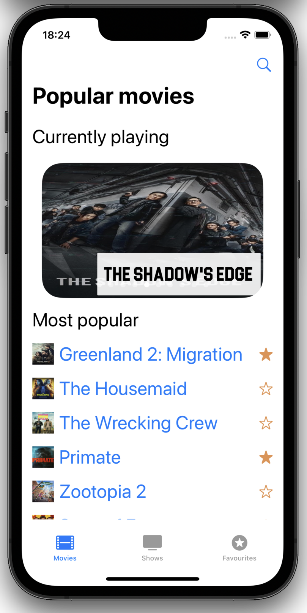
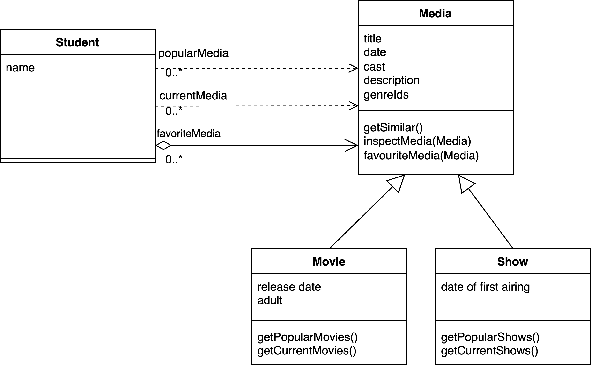

# Intro Course Project App of Bendeguz Timar for the iPraktikum

## Project readme

### Setup

Clone the project into xcode. Dependency resolution happens automatically.

**API key**

Make sure to set your [the Movie Db](https://www.themoviedb.org/settings/api) API key in `movieboy/model/constants`

## Course material

### Problem Statement

As a student, finding the correct medium to watch to waste my time with can be pretty challenging, especially when deciding between movies and series. Without a reliable source, I often end up just watching YouTube shorts.

To help me overcome this challenge, I need an iOS application that can recommend me a movie or show to watch easily. The app should allow me to see the current most popular movies, as well as search for a movie based on title.

Further than just popular movies, the application should show me a view of movies currently played in cinemas and shows that are to be aired in the next 7 days.

I should be able to temporarily save selected movies or shows as favorites, which are listed in a separate view.

The app should also give me a detailed description of the movie/show I choose, with the cast that worked on it. Furthermore, it should recommend similar movies based on the one I currently chose.

In summary, as a student who is trying to balance my sanity and my studies, I need an iOS application that can help me recommend a suitable and legal way of escaping reality, and provide me with valuable insights into that chosen medium. With such an app, I can make informed decisions about spending my time, and ultimately, achieve nirvana.

### Requirements

#### Functional requirements
Cognizant of my scholarly pursuits, I aspire to possess the capacity to...
- See a list of the current popular movies
- See a list of the current popular series
- Search for a movie or series based on the title
- Create a list of favorite movies and series
- See details of the chosen movie or series
- List of similar movies or shows similar to the chosen one
- See a view of the currently played movies
- See a view of shows that air in the next 7 days.

#### Non-functional requirements
The application is, at this moment, expected to adhere to the subsequent non-functional prerequisites:
- The app should have at least three custom SwiftUI views created
    - popular movies list page
    - popular series list page
    - favorites list page
    - details page
    - search page
    - splash screen

- The app should use Apple's SF-Symbols, follow Apple's Human Interface Guideline, and support dark mode
- The app should use MVVM architecture with at least one @Observable class
    - popular page viewmodel
    - favorites page viewmodel
    - details page viewmodel
    - search page viewmodel
- The app should use the appropriate property wrappers
- The app's views should have at least one dynamic element
    - There are lists in the favourite-, popular and search page, and there is a dynamic carousel in the popular page
- The app should include at least one asynchronous API call handled using Async/Await, handle network errors, and display appropriate error messages
    - The app is communicating with the TMDB API
- The app should make use of at least one third-party package
    - The app is using the ActivityIndicatorView on the splash screen
- Implement something from one of the tutor sessions, e.g. add an animation, use advanced concurrency, etc.
    - The app is using custom animation transition in the carousel component
- Import and display a custom font in at least one of the custom views
    - The app is using the Blockletter
- Use Apple's Logger throughout your app (introduced at WWDC20)

### Analysis

### System Design

### Product Backlog

| Ticket      | Description |
| ----------- | ----------- |
| MOVIEBOY-1  | Get list of popular movies from API |
| MOVIEBOY-2  | Implement list view to show popular movies  |
| MOVIEBOY-3  | Get a list of popular shows from API |
| MOVIEBOY-4  | Implement list view to show popular shows  |
| MOVIEBOY-5  | Implement list view to show favourited media |
| MOVIEBOY-6  | Implement search by title |
| MOVIEBOY-7  | Implement search page with list showing the results and searchbar for searching  |
| MOVIEBOY-8  | Get movie details based on movie id  |
| MOVIEBOY-9  | Implement view to show movie details  |
| MOVIEBOY-10  | Get show details based on show id  |
| MOVIEBOY-11  | Implement view to show show details |
| MOVIEBOY-12  | Get similar movies based on movie id |
| MOVIEBOY-13  | Implement list view to show similar movies |
| MOVIEBOY-14  | Get similar shows based on show id |
| MOVIEBOY-15  | Implement list view to show similar shows |
| MOVIEBOY-16 | Implement adding to the favourite list |
| MOVIEBOY-17  | Implement removing from the favourite list |
| MOVIEBOY-18  | Implement checking the favourite list membership|
| MOVIEBOY-19  | Get a list of currently played movies from API |
| MOVIEBOY-20  | Implement list view to show currently played movies |
| MOVIEBOY-21  | Get a list of shows that air in the near future |
| MOVIEBOY-22  | Implement list view to show shows that air in the next 7 days |
| MOVIEBOY-23  | Implement searching in favourite list view |
